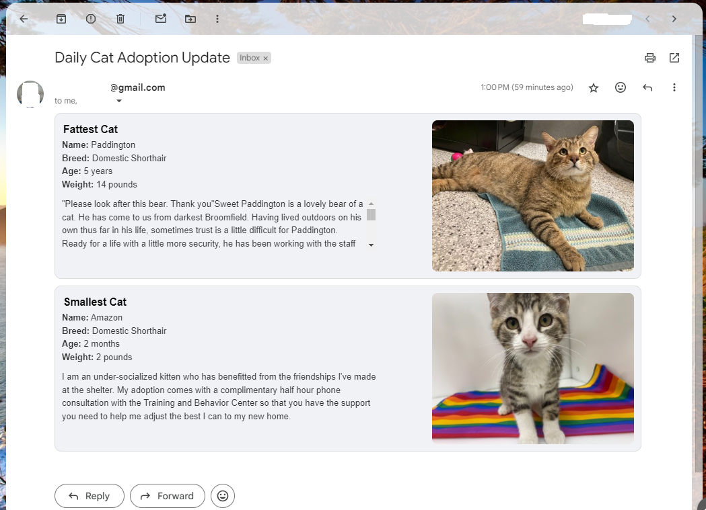

# Daily Cat Adoption Email
I built this project for my wife, she wanted a cat and would stalk the Boulder Humane Society cat rescue website day and night, showing me cats and trying to get me on board. I created this daily email for her, so she could start her day with an update showing the chunkiest, and the tiniest cat available for adoption near us right now. I eventually gave in and we got a cat, which was a great decision, but we both love getting this email so it remains active.

## Overview
This webscrapes the Boulder Humane Societies cat adoption website, gets relevant data on each cat up for adoption (i.e. name, age, weight, image, etc.), filters the data down to the largest and the smallest cat, and generates a relatively responsive block of HTML to display the data in an email that renders nicely on both desktop and mobile devices. 
<br><br>
There are some important steps involved in making sure this works every day without any manual intervention:
- Get all the Animal IDs of the cats listed for adoption
  - All these IDs are embedded in the source code on the cat adoption homepage, by grabbing all these IDs we get a full list of the cats avaible to adopt right now. This step ensures if a cat is adopted and leaves the page, or new cats are added to the page, we will be able to adjust the data collection accordingly.
  - The Humane Society uses these IDs in the URL to each specific cat, so by grabbing this list we can later pull up each cat in more detail without needing to do any chrome automation to click into each cat, which can be prone to breaking if/when things change on the website.
  - It is important to note a lot of this data is only visible in the webpage's source code after a bunch of JavaScript renders, so we have to use Selenium, which enables us to open the webpage and wait for it to render, to get the webpage's source code, as oppsoed to something like the requests library.
- Get data on each individual cat
  - Now that we have all the Animal IDs, we can open the webpage for each individual cat by passing those IDs to the URL string. This is currently being done concurrently using ThreadPoolExecutor to speed the data collection process up.
  - Then it is a matter of scrapping the data we care about from the source code
- Generate HTML
  - Now that we have our full dataset, we can pull out the two cats we want for our email and build the HTML to embed into the email
  - How I have it set up currently, if we get any descriptions for a specific cat that are too long it creates a scrolling feature so everything remains visually appealing in the email. Otherwise these cat widgets we're building in this step get to tall and look strange, especially on mobile. 
- Build and send the email
  - Finally we simply embed that HTML into an email and send it off to the recipients on the distrobution list.
 
## Example Output
Here is what one of the updates looks like on gmail desktop:


## Installation
To run this yourself, follow these steps:

- **Clone the Repository**
    ```sh
    git clone https://github.com/rd-wendling/daily-cat-adoption-email.git
    cd daily-cat-adoption-email
    ```
- **Install Dependencies**
    Make sure you have Python installed (this was created using version 3.11). Then, install the required Python packages:
    ```sh
    pip install -r requirements.txt
    ```
- **Environmental Variables**
  - **gmail_app_pwd:** Set up an app password for your gmail account you will use to send the email and make that value this variable
  - **sender_email:** The email address you want the email to send from
  - **distro_list:** A comma seperated string of email addresses to send this email to
    
Now you can edit the code to work with your own local Humane Society website and send email updates to you and yours!
